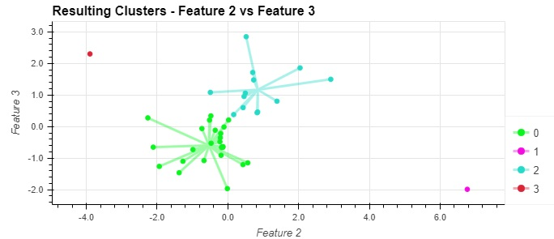

# module_10-Unsupervised-Learning
Crypto Clustering

Author: Bruno Ivasic   
Date: 4 November 2023

# Submission
Files associated with this solution:   
* [Main Jupyter Lab Notebook: /Code/crypto_investments.ipynb](./Code/crypto_investments.ipynb)
* [Shooting Start plot python module: /Code/shooting_stars.py](./Code/shooting_stars.py)

# Summary
Use K-Means and Principal Component Analysis (PCA) unsupervised machine learning applications to determine relationships between columns of data and produce a smaller number of datasets whilst preserving a high degree of useful data features, so that further focussed analysis can be conducted and obvious relationships observed.

# Briefing
In this Challenge, you’ll assume the role of an advisor at one of the top five financial advisory firms in the world. Competitors are fierce, so you want to propose a novel approach to assembling investment portfolios that are based on cryptocurrencies. Instead of basing your proposal on only returns and volatility, you want to include other factors that might impact the crypto market&mdash;leading to better performance for your portfolio.

When you present the idea, your manager loves it! So, you’re asked to create a prototype for submitting your crypto portfolio proposal to the company board of directors.

## Background
In this Challenge, you’ll combine your financial Python programming skills with the new unsupervised learning skills that you acquired in this module.

You’ll create a Jupyter notebook that clusters cryptocurrencies by their performance in different time periods. You’ll then plot the results so that you can visually show the performance to the board.

The CSV file that’s provided for this Homework contains the price change data of cryptocurrencies in different periods.

Further details on the assignment briefing are available in [Briefing.md](./Briefing.md)

## Inspiration
* The Shooting Star plots was inspired conceptually, without using or copying any source code, from: https://towardsdatascience.com/visualizing-clusters-with-pythons-matplolib-35ae03d87489

## Code Source Acknowledgement
* Remove memory leak warning code: User "wheat" on https://stackoverflow.com/a/73445664   (2022-08-22)
* Adding dots to line plots: Holoviz label references https://hvplot.holoviz.org/reference/pandas/labels.html 
* Colour codes (but no source code) for the contrasting colour scheme used with the Shooting Star plot was selected using: https://www.canva.com/colors/color-wheel/ 

---

